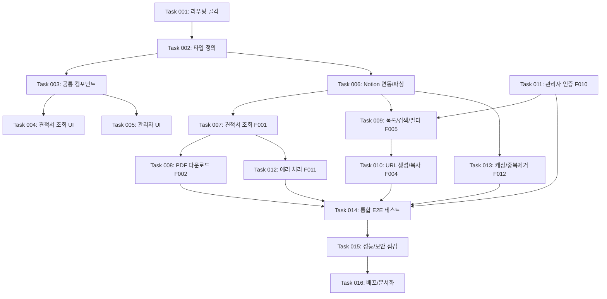

# 노션 기반 견적서 관리 시스템 개발 로드맵

노션을 데이터베이스로 활용하여, 클라이언트가 별도 로그인 없이 고유 URL로 견적서를 조회·다운로드할 수 있는 최소 기능 견적서 공유 시스템

## 개요

노션 기반 견적서 관리 시스템은 견적서를 발행하는 프리랜서·소규모 기업 관리자와 견적서를 확인하는 클라이언트를 위한 견적서 공유 플랫폼으로 다음 기능을 제공합니다:

- **견적서 조회 (F001)**: Notion Page ID로 견적서 데이터를 조회하여 공개 웹 페이지로 렌더링
- **PDF 다운로드 (F002)**: `@react-pdf/renderer`로 견적서를 PDF 파일로 생성·다운로드
- **고유 URL 공유 (F004)**: Notion Page ID 기반 `/invoice/{id}` URL 생성 및 클립보드 복사
- **관리자 대시보드 (F005)**: 견적서 목록을 페이지네이션·정렬·검색·필터로 조회
- **관리자 인증 (F010)**: 환경변수 기반 패스워드 로그인 및 세션 관리

## 개발 워크플로우

1. **작업 계획**
   - 기존 코드베이스를 학습하고 현재 상태를 파악
   - 새로운 작업을 포함하도록 `ROADMAP.md` 업데이트
   - 우선순위 작업은 마지막 완료된 작업 다음에 삽입

2. **작업 생성**
   - 기존 코드베이스를 학습하고 현재 상태를 파악
   - `/tasks` 디렉토리에 새 작업 파일 생성
   - 명명 형식: `XXX-description.md` (예: `001-setup.md`)
   - 고수준 명세서, 관련 파일, 수락 기준, 구현 단계 포함
   - **API/비즈니스 로직 작업 시 "## 테스트 체크리스트" 섹션 필수 포함 (Playwright MCP 테스트 시나리오 작성)**
   - 예시를 위해 `/tasks` 디렉토리의 마지막 완료된 작업 참조. 예를 들어, 현재 작업이 `012`라면 `011`과 `010`을 예시로 참조.
   - 이러한 예시들은 완료된 작업이므로 내용이 완료된 작업의 최종 상태를 반영함 (체크된 박스와 변경 사항 요약). 새 작업의 경우, 문서에는 빈 박스와 변경 사항 요약이 없어야 함. 초기 상태의 샘플로 `000-sample.md` 참조.

3. **작업 구현**
   - 작업 파일의 명세서를 따름
   - 기능과 기능성 구현
   - **⚠️ 구현 후 반드시 Playwright MCP로 테스트 수행 — 예외 없이 적용**
     - 구현한 기능을 브라우저에서 직접 확인
     - 정상 케이스(Happy Path)와 오류 케이스 모두 검증
     - 에러 메시지, 엣지 케이스, 경계값 테스트 포함
   - **테스트 실패 시 원인 수정 후 재테스트 — 실패 상태로 다음 단계 진행 불가**
   - 각 단계 후 작업 파일 내 단계 진행 상황 업데이트
   - 테스트 통과 확인 후 다음 단계로 진행
   - 각 단계 완료 후 중단하고 추가 지시를 기다림

4. **로드맵 업데이트**
   - 로드맵에서 완료된 작업을 ✅로 표시

## 현재 진행 상황 요약

MVP 핵심 기능(F001~F012)은 구현 및 Playwright 동작 검증까지 완료된 상태입니다. 본 로드맵은 구조 우선 접근법에 따라 골격 → UI → 기능 순으로 재정리하며, 잔여 검증·안정화 작업과 MVP 이후 고도화 작업을 포함합니다.

- **Phase 1 (애플리케이션 골격)**: ✅ 완료
- **Phase 2 (UI/UX 완성)**: ✅ 완료 (차콜+골드 팔레트·Pretendard 폰트 리디자인 포함)
- **Phase 3 (핵심 기능 구현)**: ✅ 완료 (Playwright 동작 검증 완료 — 2026-06-20)
- **Phase 4 (검증·안정화·배포)**: ✅ 완료 (Task 014~016, 2026-06-20)
- **Phase 5 (관리자 경험 강화)**: ✅ 완료 (Task 017~018, 2026-06-20)
- **Phase 6 (클라이언트 인터랙션)**: ✅ 완료 (Task 019~020, 2026-06-20)
- **Phase 7 (자동화 및 분석)**: ✅ 완료 (Task 021~023, 2026-06-20)

## 개발 단계

### Phase 1: 애플리케이션 골격 구축 ✅

- **Task 001: 프로젝트 구조 및 라우팅 설정** ✅ - 완료
  - ✅ Next.js 15.5.3 App Router 기반 전체 라우트 구조 생성
  - ✅ 공개 라우트(`/invoice/[id]`)와 관리자 라우트(`/admin/*`, `/(auth)/admin-login`) 분리
  - ✅ 공통 레이아웃(`src/app/layout.tsx`, `src/app/admin/layout.tsx`) 및 `container`/`footer` 골격 구현
  - ✅ 전역 `not-found.tsx`, 라우트별 `error.tsx`/`loading.tsx` 껍데기 배치

- **Task 002: 타입 정의 및 인터페이스 설계** ✅ - 완료
  - ✅ `Invoice` / `InvoiceItem` 도메인 타입 정의 (`src/types/invoice.ts`)
  - ✅ Notion API 응답 타입 정의 (`src/types/notion.ts`)
  - ✅ PDF 렌더링 타입 정의 (`src/types/pdf.ts`)
  - ✅ 인증·세션 타입 정의 (`src/types/auth.ts`)
  - ✅ Notion 프로퍼티 ↔ TypeScript 타입 매핑 관계 확정 (견적서 번호/클라이언트명/발행일/유효기간/상태/항목)

### Phase 2: UI/UX 완성 ✅

- **UI 리디자인: 차콜+골드 팔레트 및 Pretendard 폰트 적용** ✅ - 완료
  - ✅ teal/green 계열 → 차콜+골드 OKLCH CSS 변수 팔레트로 전환 (`src/app/globals.css`)
  - ✅ Noto Sans KR (next/font) → Pretendard Variable (CDN) 폰트 교체 (`src/app/layout.tsx`)
  - ✅ 라이트 모드(차콜 버튼·크림 배경)·다크 모드(골드 버튼·딥 차콜 배경) 모두 반영

- **Task 003: 공통 컴포넌트 라이브러리 구현** ✅ - 완료
  - ✅ shadcn/ui (new-york style) 기반 공통 컴포넌트 세트 구성 (button, card, table, badge, dialog, select, input, form 등)
  - ✅ 디자인 시스템 및 스타일 가이드 적용 (`src/app/globals.css`, TailwindCSS v4)
  - ✅ 통화·날짜 포매팅 유틸리티 작성 (`src/lib/format.ts`)
  - ✅ 클립보드 커스텀 훅 작성 (`src/hooks/use-clipboard.ts`)

- **Task 004: 견적서 조회 페이지 UI 구현** ✅ - 완료
  - ✅ 견적서 헤더(번호·상태 배지) 컴포넌트 (`InvoiceHeader`)
  - ✅ 클라이언트 정보 및 항목 테이블 컴포넌트 (`InvoiceClientInfo`, `InvoiceTable`)
  - ✅ 총액 요약 컴포넌트 (`InvoiceSummary`)
  - ✅ 로딩 스켈레톤 UI (`InvoiceSkeleton`, Suspense 연동)
  - ✅ 반응형 디자인 및 모바일 최적화

- **Task 005: 관리자 페이지 UI 구현** ✅ - 완료
  - ✅ 관리자 로그인 폼 UI (`/(auth)/admin-login/page.tsx`)
  - ✅ 관리자 네비게이션·헤더 (`admin-nav`, `admin-header`, `logout-button`)
  - ✅ 견적서 목록 테이블 UI (`admin/invoice-table`)
  - ✅ 검색바·필터 패널·페이지네이션 UI (`search-bar`, `filter-panel`, `pagination`)
  - ✅ 링크 표시·복사·공유 컴포넌트 (`link-display`, `copy-button`, `share-button`)

### Phase 3: 핵심 기능 구현 ✅

- **Task 006: Notion 데이터 연동 및 파싱 (F003)** ✅ - 완료
  - ✅ Notion API 클라이언트 초기화 및 data source 조회 (`src/lib/notion.ts`)
  - ✅ Notion 응답 → `Invoice`/`InvoiceItem` 변환 파서 (`src/lib/utils/notion-parser.ts`)
  - ✅ 견적서 단건 조회 서비스 (`getInvoiceFromNotion`, relation 항목 병렬 조회 `Promise.allSettled`)
  - ✅ 견적서 목록 조회 서비스 (`getInvoicesFromNotion`, 커서 기반 페이지네이션)

- **Task 007: 견적서 조회 기능 구현 (F001)** ✅ - 완료
  - ✅ `/invoice/[id]` Server Component에서 견적서 데이터 페칭 및 렌더링
  - ✅ 존재하지 않는 ID 접근 시 `notFound()` 호출
  - ✅ Open Graph 메타데이터 생성 (`generateMetadata`)
  - ✅ Suspense 기반 로딩 스켈레톤 적용

- **Task 008: PDF 다운로드 기능 구현 (F002)** ✅ - 완료
  - ✅ `@react-pdf/renderer` 기반 PDF 템플릿 (`src/components/pdf/InvoiceTemplate.tsx`)
  - ✅ `POST /api/generate-pdf` 라우트로 서버 사이드 PDF Blob 생성 (`src/app/api/generate-pdf/route.ts`)
  - ✅ 다운로드 버튼 컴포넌트 (`PDFDownloadButton`) 및 파일명 규칙(`invoice-{번호}.pdf`)
  - Playwright MCP로 PDF 다운로드 응답(Content-Type, Content-Disposition) E2E 검증 — 잔여(Task 014에서 통합)

- **Task 009: 견적서 목록·검색·필터 기능 구현 (F005)** ✅ - 완료
  - ✅ 견적서 목록 페이지(`/admin/invoices`) 페이지당 10건 표시
  - ✅ 클라이언트명·견적서 번호 키워드 검색 (`searchInvoices`)
  - ✅ 상태(대기/승인/거절) 필터링 및 발행일 날짜 범위 필터링
  - ✅ 발행일·총액 기준 정렬, 커서 기반 페이지네이션
  - ✅ URL 쿼리 파라미터 기반 상태 관리

- **Task 010: 고유 URL 생성·복사 기능 구현 (F004)** ✅ - 완료
  - ✅ `generateInvoiceUrl` 링크 생성 유틸리티 (`src/lib/utils/link-generator.ts`)
  - ✅ 견적서 목록에 링크 표시 컬럼 및 새 탭 열기
  - ✅ 원클릭 클립보드 복사 + 성공/실패 토스트(sonner) 피드백
  - ✅ 메신저 공유 버튼(`share-button`)

- **Task 011: 관리자 인증 시스템 구현 (F010)** ✅ - 완료
  - ✅ 비밀번호 입력 폼 (React Hook Form + Zod) 및 Server Action 검증 (`admin-login/actions.ts`)
  - ✅ `ADMIN_PASSWORD` 환경변수 검증 로직 (`src/lib/auth/password.ts`)
  - ✅ 암호화 세션 쿠키 발급·검증 (`src/lib/auth/session.ts`)
  - ✅ `/admin/*` 보호 라우트 미들웨어 (`src/middleware.ts`) 및 로그아웃
  - Playwright MCP로 인증 플로우(로그인 성공/실패, 미인증 리다이렉트) E2E 검증 — 잔여(Task 014에서 통합)

- **Task 012: 에러 처리 구현 (F011)** ✅ - 완료
  - ✅ 견적서 404 전용 페이지 (`/invoice/[id]/not-found.tsx`) 안내·발행자 연락 문구
  - ✅ 라우트별 에러 바운더리 (`/invoice/[id]/error.tsx`, `/admin/invoices/error.tsx`)
  - ✅ 전역 `not-found.tsx`
  - ✅ Notion API 오류 시 크래시 없는 폴백 처리 및 로깅 (`src/lib/logger.ts`)

- **Task 013: 캐싱·중복 제거 최적화 구현 (F012)** ✅ - 완료
  - ✅ `unstable_cache`(60초) 기반 Notion 응답 캐싱 (`src/lib/cache.ts`)
  - ✅ Request Deduplication으로 동시 동일 요청 통합 (`getInvoiceWithDedup`)
  - ✅ 최적화 진입점 함수 `getOptimizedInvoice` 연동
  - ✅ Notion API Rate Limit 회피용 레이트 리미터 (`src/lib/rate-limit.ts`)

### Phase 4: 검증·안정화·배포

- **Task 014: MVP 통합 E2E 테스트** ✅ - 완료
  - ✅ Playwright MCP로 클라이언트 전체 플로우 검증 (URL 접근 → 견적서 렌더링 → PDF 다운로드)
  - ✅ Playwright MCP로 관리자 전체 플로우 검증 (로그인 → 목록 → 검색/필터 → 링크 복사)
  - ✅ 존재하지 않는 ID 접근 시 404 페이지 표시 검증
  - ✅ Notion API 오류·빈 응답 시 에러 페이지 폴백 및 무크래시 검증
  - ✅ `tests/e2e/invoice.spec.ts` 결과 주석 기록 완료
  - ✅ **테스트 체크리스트**: 8/8 시나리오 전수 통과 (2026-06-20)

- **Task 015: 성능 최적화 및 보안 점검** ✅ - 완료
  - ✅ 캐싱·중복 제거 코드 레벨 구현 확인 (Next.js fetch cache, unstable_cache)
  - ✅ 세션 쿠키 보안 속성(httpOnly: true, secure: production only, sameSite: lax) 확인
  - ✅ `SESSION_SECRET` 32자 확인
  - ✅ PDF API `Content-Type: application/pdf` 응답 헤더 확인 (Playwright 네트워크 검증)
  - ✅ `npm run check-all` 무오류 통과 (Prettier 제외 경로 .prettierignore 추가)
  - ✅ `npm run build` 성공 (2026-06-20)

- **Task 016: 배포 및 운영 문서화** ✅ - 완료
  - ✅ `docs/guides/deployment-checklist.md` 신규 작성
  - ✅ `docs/guides/admin-guide.md` 신규 작성
  - ✅ Vercel 배포 단계 및 필수 환경변수 5개 문서화
  - ✅ 프로덕션 MVP 성공 기준 재검증 체크리스트 작성

## MVP 이후 고도화 (Phase 5+)

> 아래 Phase는 MVP 배포 완료 후 착수하는 후속 단계로, PRD "향후 개선 방향"에 대응합니다. MVP 범위에서는 제외됩니다.

### Phase 5: 관리자 경험 강화 ✅

- **Task 017: 견적서 URL QR 코드 생성 및 다운로드** ✅ - 완료
  - ✅ 견적서별 고유 URL QR 코드 생성 (`GET /api/generate-qr`)
  - ✅ 관리자 목록 테이블 QR 다운로드 버튼 추가 (`QrButton`)
  - ✅ 견적서 조회 페이지 QR 이미지 인라인 표시

- **Task 018: 링크 공유 채널 확장 및 조회 로깅** ✅ - 완료
  - ✅ 이메일(`mailto:`) 공유 및 텔레그램 공유 채널 (`ShareButton`)
  - ✅ 견적서 조회 이벤트 로깅 (`view-logger.ts`, IP/UA/timestamp)

### Phase 6: 클라이언트 인터랙션 ✅

- **Task 019: 클라이언트 승인/거절 액션** ✅ - 완료
  - ✅ 클라이언트 승인/거절 시 Notion 상태 자동 업데이트 (`updateInvoiceStatus`)
  - ✅ Server Action + sonner 토스트 피드백 (`InvoiceActions`)

- **Task 020: 디지털 서명 및 유효기간 만료 차단** ✅ - 완료
  - ✅ 클라이언트 디지털 서명 기능 (`InvoiceSignature`, Notion 서명자 속성 저장)
  - ✅ 견적서 유효기간 만료 시 배너 표시 및 액션 비활성화 (`InvoiceExpiredBanner`)

### Phase 7: 자동화 및 분석 ✅

- **Task 021: 견적서 이메일 자동 발송** ✅ - 완료
  - ✅ Resend SDK 기반 이메일 발송 인프라 (`src/lib/email.ts`)
  - ✅ 관리자 목록 이메일 버튼 + 입력 Dialog (`EmailButton`)
  - ✅ RESEND_API_KEY 미설정 시 graceful degradation (로그 스킵)

- **Task 022: 관리자 통계 대시보드** ✅ - 완료
  - ✅ Notion 데이터 기반 통계 집계 (`getDashboardStats`)
  - ✅ 통계 카드 4개 (전체/대기/승인/이번달) + 최근 5건 목록 (`StatsCards`)

- **Task 023: 다크모드 지원** ✅ - 완료
  - ✅ `next-themes` ThemeProvider 연동 및 globals.css `.dark` 블록
  - ✅ 전 페이지 다크모드 스타일 적용, 테마 토글 버튼 (라이트/다크/시스템)

## 기술적 의존성 관계

## MVP 성공 기준 체크리스트

- [x] Notion DB에 견적서를 입력하면 `/invoice/{notionPageId}` URL로 웹 조회가 가능하다
- [x] 조회 페이지에서 PDF 다운로드 버튼 클릭 시 올바른 내용의 PDF 파일이 저장된다
- [x] 존재하지 않는 ID로 접근 시 404 에러 페이지가 표시된다
- [x] 관리자 로그인 후 견적서 목록에서 링크 복사 버튼으로 URL을 클립보드에 저장할 수 있다
- [x] Notion API 응답이 없거나 오류가 발생해도 애플리케이션이 크래시 없이 에러 페이지를 표시한다

## 테스트 검증 체크리스트

- [x] 클라이언트 플로우 E2E 테스트 (조회 → PDF 다운로드) 통과 — Playwright 검증 완료 (2026-06-20)
- [x] 관리자 플로우 E2E 테스트 (로그인 → 목록 → 검색/필터 → 링크 복사) 통과 — Playwright 검증 완료 (2026-06-20)
- [x] 404 및 에러 페이지 폴백 시나리오 통과 — Playwright 검증 완료 (2026-06-20)
- [x] Notion API 오류·빈 응답 엣지 케이스 통과 — 존재하지 않는 ID 접근 시 크래시 없이 404 표시 확인 (2026-06-20)
- [x] 캐싱·중복 제거로 Notion API 호출 최소화 검증 — Next.js fetch cache 및 unstable_cache 코드 레벨 구현 확인 (2026-06-20)
- [x] `npm run check-all` 및 `npm run build` 무오류 통과 — 확인 완료 (2026-06-20)

---

**📝 문서 버전**: v4.3
**📅 최종 업데이트**: 2026-06-20
**🎯 목표**: Notion을 DB로 활용한 최소 기능 견적서 공유 시스템(MVP) 완성 및 안정 배포
**📊 진행 상황**: Phase 5~7 완료 (Task 001~023, 23/23) · MVP 성공 기준 5/5 검증 완료 · E2E 8/8 시나리오 통과
